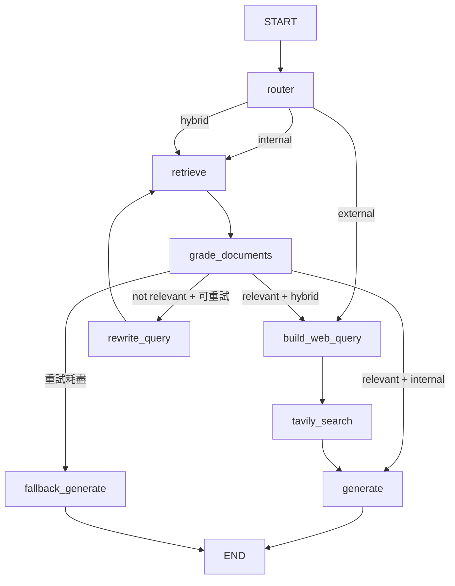

# OnboardBot：LangGraph + Corrective RAG + Tavily MCP

這是以 [原版 OnboardBot](https://github.com/shafiqul-islam-sumon/langgraph/tree/main/advanced-3-rag-conditional-routing) 為基礎擴充的三天學習專案。公司 TechCore 與全部政策均為虛構示範資料。程式保留原版的 `state.py`、`knowledge_base.py`、`nodes.py`、`graph.py`、runner、Gradio 與 prompts 分工。原作者授權見 `LICENSE`。

## 原版先讀什麼

原版固定從 `START → retrieve → grade_documents` 開始。`grade_documents` 透過結構化輸出判斷文件是否相關：相關走 `generate → END`；不相關且仍可重試走 `rewrite_query → retrieve`；重試耗盡走 `fallback_generate → END`。原版是 10 筆直接寫在 `knowledge_base.py` 的英文政策，啟動時用 `chromadb.EphemeralClient()` 與英文 SentenceTransformer embedding 建立記憶體內 Chroma；關閉程式後索引消失。這些事實可直接對照[原版 README](https://github.com/shafiqul-islam-sumon/langgraph/blob/main/advanced-3-rag-conditional-routing/README.md)及原版程式。

本版保留相同 Corrective RAG 回圈，把政策移到容易編輯的 `knowledge.json`，並改用多語 embedding。原版 fallback 依一般常識推測；本版在公司規範無法查證時直接說明缺口。

## 目錄

| 檔案 | 用途 |
|---|---|
| `state.py` | 一次問答傳遞的 State |
| `knowledge.json`、`knowledge_base.py` | 50 筆繁中示範政策與啟動時建立的 Chroma |
| `nodes.py` | Router、檢索、評分、改寫、MCP 查詢與回答節點 |
| `graph.py` | Edge、Conditional Edge 與有上限的 Retry Loop |
| `prompts/` | 各 LLM 節點的繁中指令 |
| `llm.py` | Gemini / NVIDIA LLM 包裝；NVIDIA 使用 JSON 物件輸出加 Pydantic 驗證 |
| `onboarding_runner.py` | 命令列 Demo 與 State 初始化 |
| `app.py` | 簡單 Gradio 問答與 Debug / Agent Trace |
| `tests/test_workflow.py` | 無金鑰的路由、重試、fallback、MCP 錯誤測試 |
| `.env.example`、`requirements.txt` | 環境設定與依賴 |

## 最終架構



**State** 是節點之間共享的資料：`messages` 保留問答訊息；`original_question` 永遠是使用者原句；`question` 是可改寫的 RAG 查詢；`route` 是三種來源路線；`documents` 是 Chroma 回傳文件；`doc_grade` 是相關性評分；`retry_count` 限制改寫次數；`internal_context` 是已評為相關的內部片段；`web_query` 是由問題及內部片段組成的搜尋字串；`web_domains` 限定已知官方網站；`web_results`、`web_urls` 是 MCP 搜尋結果與來源；`web_error`、`web_called` 表示搜尋狀態；`final_answer` 是回答；`trace` 記錄節點動作。

**Node** 是處理 State 的函式，**Edge** 指定下一步；**Conditional Edge** 依 `route` 或 `doc_grade` 選擇下一步。**RAG** 先從內部 Chroma 找文件，再交給 LLM 回答。**Corrective RAG** 在檢索後做文件評分；結果不相關則由 `rewrite_query` 改寫並沿 Edge 回到 `retrieve`，重試上限後停止。**Router** 只分類 internal、external、hybrid，不做規劃。**MCP** 是連接外部工具的協定；這裡由 `MultiServerMCPClient` 連接 **Tavily** 遠端 MCP，並在 `tavily_search_node` 呼叫 `tavily_search` 工具。

Hybrid 範例中，`grade_documents` 將內部文件寫入 `internal_context`，`build_web_query` 從其中取得「Node.js 22」，產生 `Node.js 22 official download site:nodejs.org`，接著 Tavily 搜尋。這是明確的 RAG → State → MCP 資料傳遞。若檢索未證實公司版本，不會搜尋猜出的版本。

## 知識庫

`knowledge.json` 共 50 筆、五類各 10 筆：人資與工作規範、資訊與開發環境、資訊安全、員工到職、行政與內部流程。每筆都有 `source`、`title`、`category`、`content`，全部內容使用臺灣繁體中文。例：`it-01`「Node.js 標準版本」明載公司要求 Node.js 22，但沒有官方下載網址；`onboarding-02` 規定新人第一週學 Docker；`hr-04` 記載加班須事前核准，但法定計算仍須外部查證。政策純屬虛構，不能作為真實勞動法令或公司規章。

索引沿用原版 `chromadb.EphemeralClient()`，每次啟動重新嵌入，不需外部資料庫。多語模型首次使用會下載，啟動可能較慢。

## Tavily MCP

依 [Tavily 官方 MCP 專案](https://github.com/tavily-ai/tavily-mcp)與[實際工具 schema](https://github.com/tavily-ai/tavily-mcp/blob/main/src/index.ts)，目前遠端 endpoint 為 `https://mcp.tavily.com/mcp/`，可透過 Authorization Bearer header 傳送 API key。本次連線實測遠端列出的工具包括 `tavily_search`、`tavily_extract`、`tavily_crawl`、`tavily_map`、`tavily_research`；本專案只使用 `tavily_search`，避免多餘的工具迴圈。工具實際名稱使用底線；官方 README 部分敘述仍用連字號寫 `tavily-search`。程式會偵測這兩種名稱。

`nodes.py` 的 `tavily_search_node` 是唯一 MCP 呼叫處。它以 `MultiServerMCPClient.get_tools()` 取得工具，再用 `search.ainvoke(...)` 查詢，解析遠端回傳的 JSON 文字，再將結果及實際 URL 寫入 State。Node.js、Docker、Python、LangGraph 與臺灣加班法規問題會限制到對應官方網域。沒有 key、伺服器無法連接或無可引用結果時，回答會顯示無法查證；不會憑空編造 URL。這個遠端連線方式符合 [LangChain MCP adapter 用法](https://github.com/langchain-ai/langchain-mcp-adapters/blob/main/README.md)。

## Windows 安裝與執行

建議 Python 3.12。於此資料夾的 PowerShell 執行：

```powershell
py -3.12 -m venv .venv
.\.venv\Scripts\python.exe -m pip install -r requirements.txt
Copy-Item .env.example .env
notepad .env
```

在 `.env` 填入 `TAVILY_API_KEY`，並選擇 `LLM_PROVIDER=nvidia` 搭配 `NVIDIA_API_KEY`、`CHAT_MODEL`，或 `LLM_PROVIDER=gemini` 搭配 `GOOGLE_API_KEY`。若已有其他位置的 `.env`，可在執行前設定 `$env:ONBOARDBOT_ENV_FILE='C:\完整路徑\.env'`，不必複製金鑰。這次提供的 `Original\TOPIC\.env` 已用此方式實測；其中 `EMBEDDING_MODEL` 是 NVIDIA 遠端模型，本專案的 Chroma 使用 `EMBEDDING_MODEL_NAME` 指定的本機多語模型。若電腦沒有 Python 3.12，可用 `uv venv --python 3.12 .venv` 及 `uv pip install --python .venv\Scripts\python.exe -r requirements.txt`。不要提交 `.env`。

```powershell
.\.venv\Scripts\python.exe app.py
# 瀏覽 http://127.0.0.1:7860
```

使用本次提供的既有憑證檔時，先在同一個 PowerShell 視窗設定：

```powershell
$env:ONBOARDBOT_ENV_FILE = 'C:\Users\blue\我的雲端硬碟\OneDrive_OneDrive_Backup\北科電子工程系碩士班_黃士嘉老師\TrainingProcess\Original\TOPIC\.env'
.\.venv\Scripts\python.exe app.py
```

命令列 Demo 與測試：

```powershell
.\.venv\Scripts\python.exe onboarding_runner.py
.\.venv\Scripts\python.exe -m unittest discover -s tests -v
```

若只填 LLM key，internal 可實際執行；external 與 hybrid 會顯示 Tavily 金鑰不足。若沒有 LLM key，無法做真實問答；`unittest` 使用可控替身檢查圖的分支與錯誤處理。

原版使用 Gemini。本版因應現有 NVIDIA 憑證加入 `ChatNVIDIA`。[Nemotron 3 Super](https://build.nvidia.com/nvidia/nemotron-3-super-120b-a12b/modelcard) 可做多語問答；但本次實測託管端點拒絕 `ChatNVIDIA.with_structured_output()` 使用的 `guided_json`。因此 NVIDIA 路線使用端點接受的 `json_object` 模式，再用 Pydantic 驗證欄位；Gemini 路線仍使用原生 `with_structured_output()`。

## 六組 Demo

| 問題 | 預期路線與觀察點 |
|---|---|
| 公司的遠端工作政策是什麼？ | internal；只有 RAG，引用遠端工作政策 |
| 目前 Node.js 官方最新 LTS 是哪一版？ | external；只呼叫 Tavily MCP，不查公司 Chroma |
| 公司要求使用哪一版的 Node.js？給我該版 Node.js 的官方下載網址。 | hybrid；RAG 取 Node.js 22 → 帶入官方搜尋 → 分列內外來源 |
| 公司要求新人第一週學 Docker，請告訴我需要學哪些內容，並幫我找最新的 Docker 官方入門教學。 | hybrid；內部到職訓練 + Docker 官方文件 |
| 公司的加班規定是什麼？目前台灣公開法規對加班有哪些規範？ | hybrid；分開說公司制度與政府公開規範 |
| 公司允許 telecommuting 嗎？ | internal；觀察 `grade_documents` 是否需要 `rewrite_query`。語意檢索也可能第一次命中，不能保證真實 LLM 每次重試；測試中有固定的「第一次不相關、第二次相關」案例。 |

Debug 區會顯示路由、檢索標題、評分、改寫後問題、搜尋字串、MCP 是否呼叫及節點 trace。

## 三天閱讀順序

1. **第 1 天：** 對照原版 README 和本版 `state.py`、`knowledge_base.py`、`retrieve_node`、`grade_documents_node`、`rewrite_query_node`，追蹤重試及 fallback。
2. **第 2 天：** 看 `router_node`、`graph.py` 的兩處 Conditional Edge，再讀 `tavily_search_node` 的 MCP 連線與結果寫入。
3. **第 3 天：** 以 Node.js hybrid 問題沿 `internal_context → web_query → web_results → final_answer` 追 State，在 Gradio Debug 區檢查六組 Demo 並回看 Mermaid 圖。

## 限制

Router 與文件評分由 LLM 執行，真實結果可能隨模型輸出變動；英文術語的 corrective demo 因多語 embedding 可能一次命中。Chroma 為記憶體內索引，重新啟動會重建。Tavily 需要網路與有效 key，公開資訊是否最新仍以實際來源頁面為準。此專案只用於教學，沒有帳號隔離或真正公司機密資料。

本機驗證：14 項可控測試全部通過；真實 Chroma 建立 50 筆索引，Node.js 查詢首筆為 `it-01`；真實 Tavily MCP 查詢取得 5 個 `nodejs.org` 網址；Gradio 啟動後本機首頁回應 HTTP 200。2026-09-24 六題真實服務測試有三題完成、三題遇到 NVIDIA `nvidia/nemotron-3-super-120b-a12b` 端點 503；2026-09-25 同樣六題皆取得最終回答，沒有 503。第二次測試仍發現 telecommuting 題誤走 hybrid，以及 Node.js 最新 LTS 與 Docker 題來源不夠相關；圖流程完成不代表答案正確。兩次原始紀錄見 `experiments/`。
